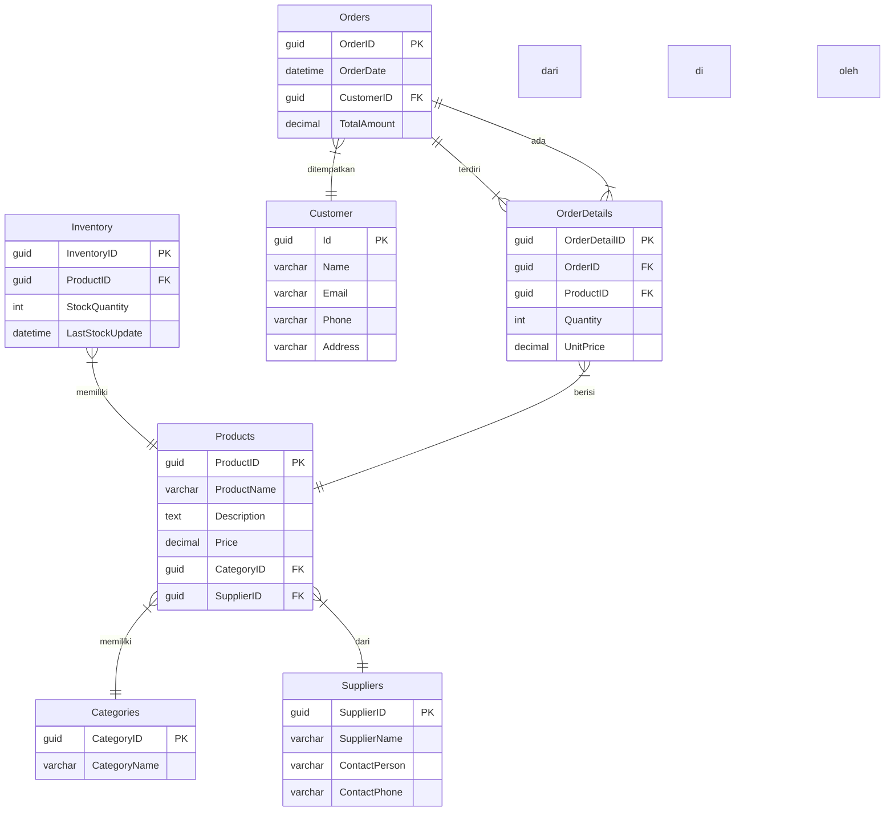

# Product Web API with ASP.NET Core 8 and LINQ

This project is an example implementation of a Web API using ASP.NET Core 8 with LINQ as the Object-Relational Mapper (ORM). The use case is the management of product data through the `Product` table.

## Features

* **Product CRUD (Create, Read, Update, Delete):**
    * Add new products.
    * View a list of all products.
    * View product details by ID.
    * Modify product data.
    * Delete products.
* **LINQ for Data Access:**
    * Implementation of database operations using LINQ for ease and flexibility.
* **RESTful API Architecture:**
    * API design follows RESTful principles for ease of use and scalability.
* **In-Memory or SQL Server Database:**
    * The project can be configured to use an in-memory database for development or SQL Server for production.

## Technologies Used

* **ASP.NET Core 8:** Web framework for building APIs.
* **.NET 8:** Development platform.
* **Entity Framework Core:** ORM for database access.
* **LINQ (Language Integrated Query):** Integrated query language for data manipulation.
* **SQL Server (optional):** Relational database.
* **Swagger/OpenAPI:** API documentation.

## Setup

1.  **Install .NET 8 SDK:**
    * Download and install the .NET 8 SDK from the official Microsoft website.
2.  **Install Visual Studio or Visual Studio Code:**
    * Use Visual Studio or Visual Studio Code as your IDE.
3.  **Install SQL Server (optional):**
    * If you want to use SQL Server, install and configure SQL Server on your computer.

## Configuration

1.  **Database Configuration:**
    * Open the `appsettings.json` file.
    * Change the connection string according to your database configuration.
        * To use an in-memory database, leave the default configuration.
        * To use SQL Server, replace the connection string with a connection to your SQL Server database.
2.  **Database Migration:**
    * Open a terminal in the project directory.
    * Run the following commands to create migrations and update the database:
        * `dotnet ef migrations add InitialCreate`
        * `dotnet ef database update`

## How to Run the Application

1.  **Open the project in Visual Studio or Visual Studio Code.**
2.  **Run the application by pressing the "Run" button or using the `dotnet run` command in the terminal.**
3.  **Open a browser and access the API URL (e.g., `https://localhost:5001/swagger`) to view the Swagger documentation.**
4.  **Use Postman or a similar tool to test the API endpoints.**

## API Endpoints

* `GET /api/products`: Get a list of all products.
* `GET /api/products/{id}`: Get product details by ID.
* `POST /api/products`: Add a new product.
* `PUT /api/products/{id}`: Modify product data.
* `DELETE /api/products/{id}`: Delete a product.

## Usage Examples

* **Add Product:**

    ```json
    POST /api/products
    {
      "name": "Laptop XYZ",
      "description": "High-specification laptop",
      "price": 12000000
    }
    ```

* **Get Product List:**

    ```json
    GET /api/products
    ```

## Contribution

If you would like to contribute to this project, please fork the repository and submit a pull request.

## License

This project is licensed under the \[MIT/Apache 2.0/etc.] license.

## Authentication and Authorization

The API uses JWT (JSON Web Token) authentication. To access protected endpoints, you need to:

1. Register a new user or use the default admin account:
   - Default admin credentials:
     - Username: admin
     - Email: admin@example.com
     - Password: Admin123!

2. Obtain a JWT token by logging in:
```http
POST /api/Auth/login
Content-Type: application/json

{
    "username": "your_username",
    "password": "your_password"
}
```

3. Use the token in subsequent requests:
   - Add the Authorization header: `Bearer your_token_here`
   - In Swagger UI: 
     1. Click the "Authorize" button (lock icon) at the top right of the page
     2. In the popup dialog, enter your token in the format: `Bearer your_token_here`
     3. Click "Authorize" and close the dialog
     4. All subsequent API calls will include your token

### Using Swagger UI with JWT Authentication

1. Start the application and navigate to the Swagger UI (usually at `/swagger`)
2. First, make a POST request to `/api/Auth/login` with your credentials to get a token
3. Click the "Authorize" button (lock icon) at the top right of the Swagger UI
4. In the popup dialog, enter your token in the format: `Bearer your_token_here`
   - Make sure to include the word "Bearer" followed by a space before your token
5. Click "Authorize" and close the dialog
6. Now you can access protected endpoints through the Swagger UI
7. The lock icons next to endpoints indicate whether they require authentication

### Protected Endpoints

#### Categories
- Public endpoints (no authentication required):
  ```http
  GET /api/Category
  GET /api/Category/{id}
  ```

- Admin-only endpoints (requires admin role):
  ```http
  POST /api/Category
  PUT /api/Category/{id}
  DELETE /api/Category/{id}
  ```

### User Roles
- **User**: Basic authenticated user
  - Can access protected endpoints
  - Cannot modify system data

- **Admin**: Administrative user
  - Full access to all endpoints
  - Can manage categories, products, and other system data
  - Can view list of users

### Authentication Examples

1. Login and get token:
```http
POST /api/Auth/login
Content-Type: application/json

{
    "username": "admin",
    "password": "Admin123!"
}
```

2. Create a new category (Admin only):
```http
POST /api/Category
Authorization: Bearer your_token_here
Content-Type: application/json

{
    "name": "New Category"
}
```

3. Get current user info:
```http
GET /api/Auth/me
Authorization: Bearer your_token_here
```

### Error Responses

- **401 Unauthorized**: Missing or invalid token
- **403 Forbidden**: Valid token but insufficient permissions
- **400 Bad Request**: Invalid input data
- **404 Not Found**: Resource not found

# ERD API Produk

## Entitas

### Products

* **ProductID** (INT, Primary Key)
* **ProductName** (VARCHAR)
* **Description** (TEXT)
* **Price** (DECIMAL)
* **CategoryID** (INT, Foreign Key)
* **SupplierID** (INT, Foreign Key)

### Categories

* **CategoryID** (INT, Primary Key)
* **CategoryName** (VARCHAR)

### Inventory

* **InventoryID** (INT, Primary Key)
* **ProductID** (INT, Foreign Key)
* **StockQuantity** (INT)
* **LastStockUpdate** (DATETIME)

### Suppliers

* **SupplierID** (INT, Primary Key)
* **SupplierName** (VARCHAR)
* **ContactPerson** (VARCHAR)
* **ContactPhone** (VARCHAR)

### Orders

* **OrderID** (INT, Primary Key)
* **OrderDate** (DATETIME)
* **CustomerID** (INT, Foreign Key)
* **TotalAmount** (DECIMAL)

### OrderDetails

* **OrderDetailID** (INT, Primary Key)
* **OrderID** (INT, Foreign Key)
* **ProductID** (INT, Foreign Key)
* **Quantity** (INT)
* **UnitPrice** (DECIMAL)

## Relasi

* Products memiliki satu Category (1:1..*).
* Products memiliki satu Supplier (1:1).
* Inventory terhubung ke satu Product (1:1).
* Orders terdiri dari banyak OrderDetails (1:N).
* OrderDetails terhubung ke satu Order (N:1).
* OrderDetails terhubung ke satu Product (N:1).

## Diagram


### to do

* laporan penjualan per product
* laporan penjualan per customer
* laporan detail penjualan
* laporan riwayat perubahan stok
* laporan nilai inventaris
* laporan pembelian per supplier
* laporan pembelian per produk
* laporan detail pembelian
* laporan produk per category - done
***
* Laporan Profitabilitas Produk Per Kategori dan Supplier
* Laporan Tren Pembelian Produk dari Supplier ke Pelanggan