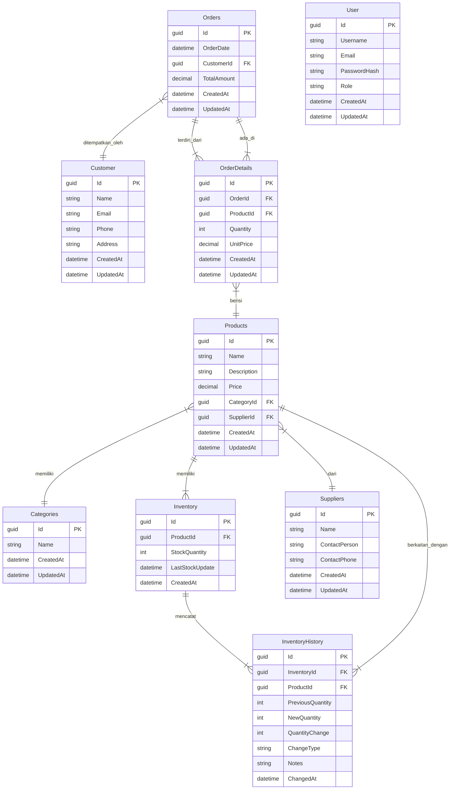

# Product Web API with ASP.NET Core 8 and LINQ

This project is an example implementation of a Web API using ASP.NET Core 8 with LINQ as the Object-Relational Mapper (ORM). The use case is the management of product data through the `Product` table.

## Features

* **Product CRUD (Create, Read, Update, Delete):**
    * Add new products.
    * View a list of all products.
    * View product details by ID.
    * Modify product data.
    * Delete products.
* **LINQ for Data Access:**
    * Implementation of database operations using LINQ for ease and flexibility.
* **RESTful API Architecture:**
    * API design follows RESTful principles for ease of use and scalability.
* **In-Memory or SQL Server Database:**
    * The project can be configured to use an in-memory database for development or SQL Server for production.

## Technologies Used

* **ASP.NET Core 8:** Web framework for building APIs.
* **.NET 8:** Development platform.
* **Entity Framework Core:** ORM for database access.
* **LINQ (Language Integrated Query):** Integrated query language for data manipulation.
* **SQL Server (optional):** Relational database.
* **Swagger/OpenAPI:** API documentation.

## Setup

1.  **Install .NET 8 SDK:**
    * Download and install the .NET 8 SDK from the official Microsoft website.
2.  **Install Visual Studio or Visual Studio Code:**
    * Use Visual Studio or Visual Studio Code as your IDE.
3.  **Install SQL Server (optional):**
    * If you want to use SQL Server, install and configure SQL Server on your computer.

## Configuration

1.  **Database Configuration:**
    * Open the `appsettings.json` file.
    * Change the connection string according to your database configuration.
        * To use an in-memory database, leave the default configuration.
        * To use SQL Server, replace the connection string with a connection to your SQL Server database.
2.  **Database Migration:**
    * Open a terminal in the project directory.
    * Run the following commands to create migrations and update the database:
        * `dotnet ef migrations add InitialCreate`
        * `dotnet ef database update`

## How to Run the Application

1.  **Open the project in Visual Studio or Visual Studio Code.**
2.  **Run the application by pressing the "Run" button or using the `dotnet run` command in the terminal.**
3.  **Open a browser and access the API URL (e.g., `https://localhost:5001/swagger`) to view the Swagger documentation.**
4.  **Use Postman or a similar tool to test the API endpoints.**

## API Endpoints

### Authentication
* `POST /api/Auth/login` - Login dan mendapatkan token JWT
* `POST /api/Auth/register` - Registrasi pengguna baru
* `GET /api/Auth/me` - Mendapatkan informasi user yang sedang login

### Products
* `GET /api/Products` - Mendapatkan daftar semua produk
* `GET /api/Products/{id}` - Mendapatkan detail produk berdasarkan ID
* `POST /api/Products` - Menambahkan produk baru (Auth)
* `PUT /api/Products/{id}` - Mengubah data produk (Auth)
* `DELETE /api/Products/{id}` - Menghapus produk (Auth)

### Categories
* `GET /api/Categories` - Mendapatkan daftar semua kategori
* `GET /api/Categories/{id}` - Mendapatkan detail kategori berdasarkan ID
* `POST /api/Categories` - Menambahkan kategori baru (Admin only)
* `PUT /api/Categories/{id}` - Mengubah data kategori (Admin only)
* `DELETE /api/Categories/{id}` - Menghapus kategori (Admin only)

### Suppliers
* `GET /api/Suppliers` - Mendapatkan daftar semua supplier
* `GET /api/Suppliers/{id}` - Mendapatkan detail supplier berdasarkan ID
* `POST /api/Suppliers` - Menambahkan supplier baru (Auth)
* `PUT /api/Suppliers/{id}` - Mengubah data supplier (Auth)
* `DELETE /api/Suppliers/{id}` - Menghapus supplier (Auth)

### Inventory
* `GET /api/Inventory` - Mendapatkan daftar semua inventaris
* `GET /api/Inventory/{id}` - Mendapatkan detail inventaris berdasarkan ID
* `POST /api/Inventory` - Menambahkan inventaris baru (Auth)
* `PUT /api/Inventory/{id}` - Mengubah data inventaris (Auth)
* `DELETE /api/Inventory/{id}` - Menghapus inventaris (Auth)

### Orders
* `GET /api/Orders` - Mendapatkan daftar semua pesanan
* `GET /api/Orders/{id}` - Mendapatkan detail pesanan berdasarkan ID
* `POST /api/Orders` - Menambahkan pesanan baru (Auth)
* `PUT /api/Orders/{id}` - Mengubah data pesanan (Auth)
* `DELETE /api/Orders/{id}` - Menghapus pesanan (Auth)

### OrderDetails
* `GET /api/OrderDetails` - Mendapatkan daftar semua detail pesanan
* `GET /api/OrderDetails/{id}` - Mendapatkan detail pesanan berdasarkan ID
* `POST /api/OrderDetails` - Menambahkan detail pesanan baru (Auth)
* `PUT /api/OrderDetails/{id}` - Mengubah data detail pesanan (Auth)
* `DELETE /api/OrderDetails/{id}` - Menghapus detail pesanan (Auth)

### Customers
* `GET /api/Customers` - Mendapatkan daftar semua pelanggan
* `GET /api/Customers/{id}` - Mendapatkan detail pelanggan berdasarkan ID
* `POST /api/Customers` - Menambahkan pelanggan baru (Auth)
* `PUT /api/Customers/{id}` - Mengubah data pelanggan (Auth)
* `DELETE /api/Customers/{id}` - Menghapus pelanggan (Auth)

### Reports
* `GET /api/Report/products-by-category` - Laporan produk berdasarkan kategori
* `GET /api/Report/products-by-category/{categoryId}` - Laporan produk untuk kategori tertentu
* `GET /api/Report/purchase-details` - Laporan detail pembelian untuk semua pesanan
* `GET /api/Report/purchase-details/{orderId}` - Laporan detail pembelian untuk pesanan tertentu
* `GET /api/Report/inventory-value` - Laporan nilai inventaris (Auth)
* `GET /api/Report/stock-history` - Laporan riwayat perubahan stok (Auth)
* `GET /api/Report/stock-history/product/{productId}` - Laporan riwayat perubahan stok untuk produk tertentu (Auth)

## Usage Examples

* **Login dan Mendapatkan Token:**
    ```http
    POST /api/Auth/login
    Content-Type: application/json

    {
        "username": "admin",
        "password": "Admin123!"
    }
    ```

* **Menambahkan Produk Baru:**
    ```http
    POST /api/Products
    Authorization: Bearer your_token_here
    Content-Type: application/json

    {
        "name": "Laptop XYZ",
        "description": "High-specification laptop",
        "price": 12000000,
        "categoryId": "c8ad5706-e54c-4c23-b5d8-c22db2984193",
        "supplierId": "a67c9d1e-25a8-4f44-b73e-f536b8bce410"
    }
    ```

* **Mendapatkan Daftar Produk:**
    ```http
    GET /api/products
    ```

* **Membuat Pesanan Baru:**
    ```http
    POST /api/Orders
    Authorization: Bearer your_token_here
    Content-Type: application/json

    {
        "customerId": "f1b2c3d4-e5f6-7a8b-9c0d-1e2f3a4b5c6d",
        "orderDetails": [
            {
                "productId": "a1b2c3d4-e5f6-7a8b-9c0d-1e2f3a4b5c6d",
                "quantity": 2,
                "unitPrice": 1200000
            },
            {
                "productId": "b1b2c3d4-e5f6-7a8b-9c0d-1e2f3a4b5c6d",
                "quantity": 1,
                "unitPrice": 500000
            }
        ]
    }
    ```

* **Mendapatkan Laporan Nilai Inventaris:**
    ```http
    GET /api/Report/inventory-value
    Authorization: Bearer your_token_here
    ```

## Contribution

If you would like to contribute to this project, please fork the repository and submit a pull request.

## License

This project is licensed under the \[MIT/Apache 2.0/etc.] license.

## Authentication and Authorization

The API uses JWT (JSON Web Token) authentication. To access protected endpoints, you need to:

1. Register a new user or use the default admin account:
   - Default admin credentials:
     - Username: admin
     - Email: admin@example.com
     - Password: Admin123!

2. Obtain a JWT token by logging in:
```http
POST /api/Auth/login
Content-Type: application/json

{
    "username": "your_username",
    "password": "your_password"
}
```

3. Use the token in subsequent requests:
   - Add the Authorization header: `Bearer your_token_here`
   - In Swagger UI: 
     1. Click the "Authorize" button (lock icon) at the top right of the page
     2. In the popup dialog, enter your token in the format: `Bearer your_token_here`
     3. Click "Authorize" and close the dialog
     4. All subsequent API calls will include your token

### Using Swagger UI with JWT Authentication

1. Start the application and navigate to the Swagger UI (usually at `/swagger`)
2. First, make a POST request to `/api/Auth/login` with your credentials to get a token
3. Click the "Authorize" button (lock icon) at the top right of the Swagger UI
4. In the popup dialog, enter your token in the format: `Bearer your_token_here`
   - Make sure to include the word "Bearer" followed by a space before your token
5. Click "Authorize" and close the dialog
6. Now you can access protected endpoints through the Swagger UI
7. The lock icons next to endpoints indicate whether they require authentication

### Protected Endpoints

#### Categories
- Public endpoints (no authentication required):
  ```http
  GET /api/Category
  GET /api/Category/{id}
  ```

- Admin-only endpoints (requires admin role):
  ```http
  POST /api/Category
  PUT /api/Category/{id}
  DELETE /api/Category/{id}
  ```

### User Roles
- **User**: Basic authenticated user
  - Can access protected endpoints
  - Cannot modify system data

- **Admin**: Administrative user
  - Full access to all endpoints
  - Can manage categories, products, and other system data
  - Can view list of users

### Authentication Examples

1. Login and get token:
```http
POST /api/Auth/login
Content-Type: application/json

{
    "username": "admin",
    "password": "Admin123!"
}
```

2. Create a new category (Admin only):
```http
POST /api/Category
Authorization: Bearer your_token_here
Content-Type: application/json

{
    "name": "New Category"
}
```

3. Get current user info:
```http
GET /api/Auth/me
Authorization: Bearer your_token_here
```

### Error Responses

- **401 Unauthorized**: Missing or invalid token
- **403 Forbidden**: Valid token but insufficient permissions
- **400 Bad Request**: Invalid input data
- **404 Not Found**: Resource not found

# Database Schema dan Relasi

## Model Entitas dan Relasinya

### Products
* **Id** (Guid, Primary Key)
* **Name** (string)
* **Description** (string)
* **Price** (decimal)
* **CategoryId** (Guid, Foreign Key)
* **SupplierId** (Guid, Foreign Key)
* **CreatedAt** (DateTime)
* **UpdatedAt** (DateTime)

### Categories
* **Id** (Guid, Primary Key)
* **Name** (string)
* **CreatedAt** (DateTime)
* **UpdatedAt** (DateTime)

### Inventory
* **Id** (Guid, Primary Key)
* **ProductId** (Guid, Foreign Key)
* **StockQuantity** (int)
* **LastStockUpdate** (DateTime)
* **CreatedAt** (DateTime)

### InventoryHistory
* **Id** (Guid, Primary Key)
* **InventoryId** (Guid, Foreign Key)
* **ProductId** (Guid, Foreign Key)
* **PreviousQuantity** (int)
* **NewQuantity** (int)
* **QuantityChange** (int)
* **ChangeType** (string) - "Addition", "Reduction", "Adjustment"
* **Notes** (string)
* **ChangedAt** (DateTime)

### Suppliers
* **Id** (Guid, Primary Key)
* **Name** (string)
* **ContactPerson** (string)
* **ContactPhone** (string)
* **CreatedAt** (DateTime)
* **UpdatedAt** (DateTime)

### Customer
* **Id** (Guid, Primary Key)
* **Name** (string)
* **Email** (string)
* **Phone** (string)
* **Address** (string)
* **CreatedAt** (DateTime)
* **UpdatedAt** (DateTime)

### Orders
* **Id** (Guid, Primary Key)
* **OrderDate** (DateTime)
* **CustomerId** (Guid, Foreign Key)
* **TotalAmount** (decimal)
* **CreatedAt** (DateTime)
* **UpdatedAt** (DateTime)

### OrderDetails
* **Id** (Guid, Primary Key)
* **OrderId** (Guid, Foreign Key)
* **ProductId** (Guid, Foreign Key)
* **Quantity** (int)
* **UnitPrice** (decimal)
* **CreatedAt** (DateTime)
* **UpdatedAt** (DateTime)

### User
* **Id** (Guid, Primary Key)
* **Username** (string)
* **Email** (string)
* **PasswordHash** (string)
* **Role** (string) - "User", "Admin"
* **CreatedAt** (DateTime)
* **UpdatedAt** (DateTime)

## Relasi Antar Tabel

1. **Products ↔ Categories** (Many-to-One)
   - Setiap produk memiliki satu kategori
   - Satu kategori dapat memiliki banyak produk

2. **Products ↔ Suppliers** (Many-to-One)
   - Setiap produk memiliki satu supplier
   - Satu supplier dapat memasok banyak produk

3. **Products ↔ Inventory** (One-to-Many)
   - Setiap produk dapat memiliki beberapa catatan inventaris
   - Satu catatan inventaris hanya terkait dengan satu produk

4. **Products ↔ OrderDetails** (One-to-Many)
   - Satu produk dapat berada di banyak detail pesanan
   - Satu detail pesanan hanya terkait dengan satu produk

5. **Inventory ↔ InventoryHistory** (One-to-Many)
   - Satu catatan inventaris dapat memiliki banyak riwayat perubahan
   - Satu riwayat perubahan hanya terkait dengan satu inventaris

6. **Orders ↔ OrderDetails** (One-to-Many)
   - Satu pesanan dapat terdiri dari banyak detail pesanan
   - Satu detail pesanan hanya terkait dengan satu pesanan

7. **Customers ↔ Orders** (One-to-Many)
   - Satu pelanggan dapat membuat banyak pesanan
   - Satu pesanan hanya terkait dengan satu pelanggan

## Diagram ER



### Keterangan Format Data

* **Guid**: Pengenal unik universal (direpresentasikan sebagai string di API)
* **DateTime**: Format ISO 8601 (misal: "2023-03-15T14:30:00Z")
* **Decimal**: Angka dengan titik desimal (misal: 1500000.00)

### Struktur Respons API

#### Daftar (List):
```json
{
  "message": "Data retrieved successfully",
  "success": true,
  "data": [
    { /* item data */ },
    { /* item data */ }
  ]
}
```

#### Detail (Single Item):
```json
{
  "message": "Data retrieved successfully",
  "success": true,
  "data": { /* item data */ }
}
```

#### Error:
```json
{
  "message": "Error message",
  "success": false,
  "errors": ["Error detail 1", "Error detail 2"]
}
```